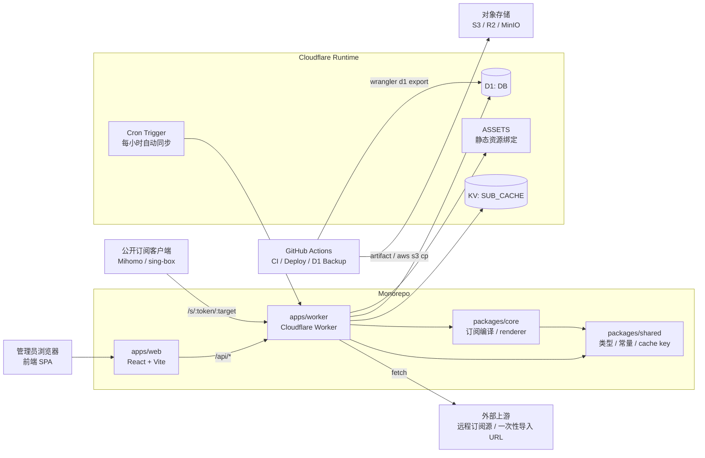
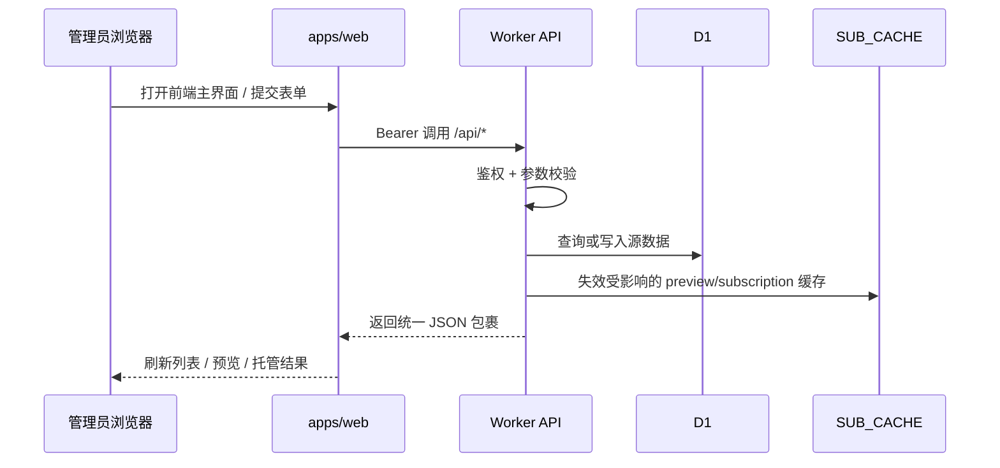
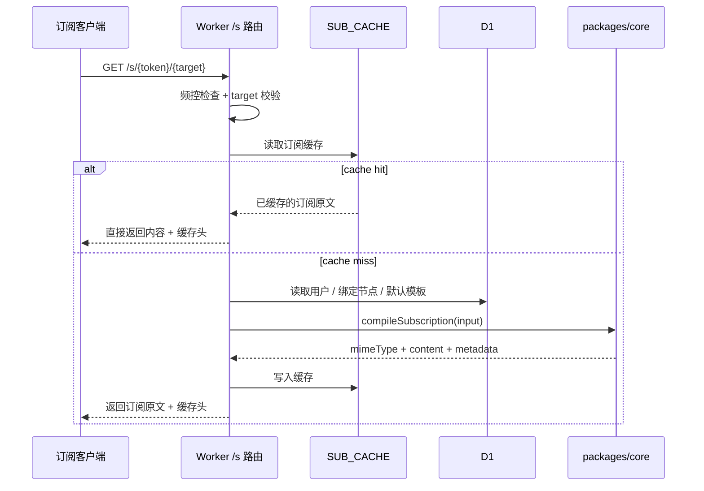
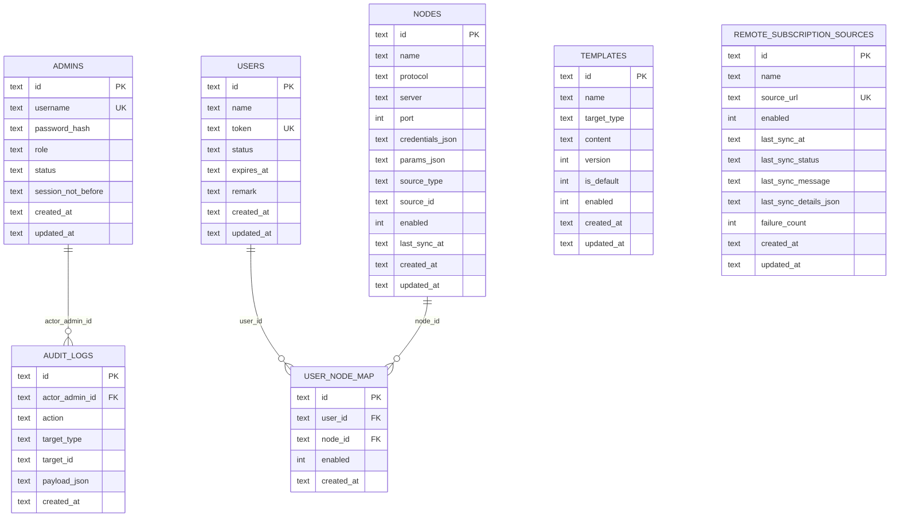

# SubForge 架构图、ER 图与数据模型

## 1. 文档目的

这份文档把当前仓库里已经落地的系统结构收敛成三部分：

- 运行时架构图：前两部分继续直接使用 Mermaid 图表达，帮助快速理解 `apps/web`、`apps/worker`、`packages/core`、`packages/shared`、Cloudflare 绑定资源与外部依赖如何协同
- ER 图：帮助快速理解当前 D1 中真正仍在使用的核心实体与关系
- 数据模型说明：帮助快速理解当前表结构、索引、共享类型映射，以及哪些能力只是内部实现

与其他文档的分工：

- `docs/实施方案.md`：解释为什么这样分层、哪些是当前设计基线
- `docs/API参考与接口约定.md` 与 `openapi.yaml`：解释接口契约
- `docs/部署指南.md`：解释 Cloudflare、GitHub Actions 与 D1 备份恢复步骤

## 2. 阅读约定

阅读这份文档时，可以先记住 5 个原则：

1. Worker 是唯一对外运行时入口：同时处理 `/api/*`、`/s/:token/:target` 与静态资源兜底
2. D1 存事实数据，KV `SUB_CACHE` 存派生缓存和轻量限流计数，不作为事实来源
3. `packages/core` 负责订阅编译，`packages/shared` 负责共享类型、常量、错误码与 cache key 约定
4. `remote_subscription_sources` 是当前唯一长期自动同步对象；没有独立的 `rule_sources / rule_snapshots / sync_logs` 主链路
5. `audit_logs` 仍在数据库里写入，但当前只作为内部审计能力，不再暴露独立 UI 或 API

## 3. 运行时架构图

### 3.1 总体架构



### 3.2 分层说明

- `apps/web`
  - 单用户前端 SPA
  - 通过 `apps/web/src/api.ts` 调用 Worker API
  - 主界面围绕节点导入、节点调整、自动同步源、托管 URL 与订阅诊断展开
- `apps/worker`
  - 对外暴露 `/health`、`/api/*`、`/s/:token/:target`
  - 负责鉴权、参数校验、D1 读写、缓存失效、自动同步触发与内部审计写入
  - 通过 `env.ASSETS.fetch(request)` 兜底前端静态资源
- `packages/core`
  - 负责把用户、绑定节点、模板骨架编译为最终订阅
  - 负责节点协议转换、链式代理校验与 Mihomo 模板结构净化
- `packages/shared`
  - 负责共享枚举、领域类型、错误码、cache key、目标类型常量
  - 仍导出少量模板 / 规则 cache helper 以兼容旧引用，但当前 Worker 主链路不依赖这些 key
- `D1`
  - 存管理员、用户、节点、模板、用户节点绑定、自动同步源与内部审计日志
- `SUB_CACHE`
  - 存 preview / subscription 缓存
  - 也存管理员登录与公开订阅轻量限流计数

## 4. 关键数据流

### 4.1 前端管理请求流



### 4.2 公开订阅输出流



补充说明：

- 当前 `getSubscriptionCompileInputByUserId()` 会把 `ruleSets` 固定为空数组
- 公开订阅是否可用，核心取决于用户状态、绑定节点、模板骨架与渲染器兜底

### 4.3 同步与运维流

```mermaid
flowchart TD
  Cron[Cron Trigger] --> Sync[Worker scheduled()]
  Manual[管理员手动同步] --> Sync
  Sync --> Fetch[拉取 remote_subscription_sources]
  Fetch --> Parse[解析分享链接 / Base64 / YAML / JSON]
  Parse --> Validate[去重 + 链式代理校验]
  Validate --> Upsert[写入 / 更新 / 禁用 nodes]
  Upsert --> SourceState[更新 last_sync_status / message / details]
  SourceState --> CacheInvalidate[清理受影响用户缓存]

  Backup[GitHub Actions D1 Backup] --> Export[wrangler d1 export]
  Export --> Archive[artifact / .enc / .sha256]
  Archive --> Storage[GitHub Artifact / 对象存储]
```

补充说明：

- Cron 当前只负责启用中的自动同步源
- 同步失败时只更新同步源状态，不会先行覆盖现有有效节点
- 删除自动同步源时，会一并删除其远程节点并刷新受影响绑定

## 5. ER 图



## 6. 数据模型总览

### 6.1 核心表

当前 D1 的现行核心表只有 7 张：

- `admins`
- `users`
- `nodes`
- `templates`
- `remote_subscription_sources`
- `user_node_map`
- `audit_logs`

其中：

- `admins` 负责管理员账号与服务端会话撤销基线
- `users` 负责订阅用户与公开 token
- `nodes` 负责节点元数据与链式代理参数
- `templates` 负责 `mihomo` / `singbox` 目标模板骨架
- `remote_subscription_sources` 负责长期自动同步的上游订阅元数据与诊断状态
- `user_node_map` 负责用户与节点绑定
- `audit_logs` 负责内部审计追踪

### 6.2 共享类型与约束

当前共享层中最关键的类型与枚举：

- `SubscriptionTarget`
  - `mihomo`
  - `singbox`
- `UserStatus`
  - `active`
  - `disabled`
- `AdminStatus`
  - `active`
  - `disabled`
- `NodeSourceType`
  - `manual`
  - `remote`
- `TemplateStatus`
  - `enabled`
  - `disabled`
- `SyncLogStatus`
  - `success`
  - `failed`
  - `skipped`

补充说明：

- `SyncLogStatus` 仍用于 `remote_subscription_sources.last_sync_status`
- 当前没有独立的 `sync_logs` 表，也没有单独的 `RuleSourceRecord / RuleSnapshotRecord`

### 6.3 表结构速览

#### `admins`

用途：

- 存储管理员账号
- 登录时按 `username` 查询
- `session_not_before` 用于服务端撤销旧会话

主要字段：

- `id`
- `username`
- `password_hash`
- `role`
- `status`
- `session_not_before`
- `created_at`
- `updated_at`

#### `users`

用途：

- 存储订阅用户
- `token` 用于公开订阅 `/s/:token/:target`

主要字段：

- `id`
- `name`
- `token`
- `status`
- `expires_at`
- `remark`
- `created_at`
- `updated_at`

相关行为：

- 当前前端主流程默认围绕自动托管用户展开
- 用户资料或 token 变更会失效对应 preview / subscription 缓存

#### `nodes`

用途：

- 存储节点基础信息
- 供订阅编译时组装代理节点列表

主要字段：

- `id`
- `name`
- `protocol`
- `server`
- `port`
- `credentials_json`
- `params_json`
- `source_type`
- `source_id`
- `enabled`
- `last_sync_at`
- `created_at`
- `updated_at`

相关行为：

- 当前支持单个创建、更新、删除、批量导入与完整配置提取
- 自动同步源写入的节点会落在同一张表里，依靠 `source_type=remote` 与 `source_id` 区分来源
- 节点更新或删除会失效受影响用户缓存

#### `templates`

用途：

- 存储订阅模板骨架
- 按 `target_type` 区分 `mihomo` 与 `singbox`

主要字段：

- `id`
- `name`
- `target_type`
- `content`
- `version`
- `is_default`
- `enabled`
- `created_at`
- `updated_at`

相关行为：

- 每个目标类型允许切换默认模板
- 默认模板变化会触发按目标类型的缓存失效
- Mihomo 默认模板会经过结构净化与托管骨架校验

#### `remote_subscription_sources`

用途：

- 记录长期自动同步的上游订阅 URL
- 保存最近同步状态、错误消息与结构化详情

主要字段：

- `id`
- `name`
- `source_url`
- `enabled`
- `last_sync_at`
- `last_sync_status`
- `last_sync_message`
- `last_sync_details_json`
- `failure_count`
- `created_at`
- `updated_at`

相关行为：

- 支持 `GET / POST / PATCH / DELETE / POST :id/sync`
- 支持 Cron 自动同步与管理员手动同步
- 同步时会把解析出的节点写入 `nodes`，并刷新受影响绑定与缓存
- 如果 `source_url` 被修改，历史同步状态会重置

#### `user_node_map`

用途：

- 管理用户与节点的多对多绑定关系

主要字段：

- `id`
- `user_id`
- `node_id`
- `enabled`
- `created_at`

关系：

- `user_id -> users.id`
- `node_id -> nodes.id`
- `(user_id, node_id)` 唯一

相关行为：

- 当前通过“替换绑定列表”方式写入
- 绑定变化会触发用户缓存失效

#### `audit_logs`

用途：

- 记录管理员操作审计

主要字段：

- `id`
- `actor_admin_id`
- `action`
- `target_type`
- `target_id`
- `payload_json`
- `created_at`

关系：

- `actor_admin_id -> admins.id`

相关行为：

- 当前仍在 Worker 写接口中持续写入
- `payload_json` 里保留脱敏后的操作上下文与资源摘要
- 当前没有独立的 `audit_logs` 查询 API 或前端页面

## 7. 关系解释

### 7.1 强关系

- `admins -> audit_logs`
  - 一个管理员可以产生多条审计日志
- `users <-> nodes`
  - 通过 `user_node_map` 建立多对多关系
  - 订阅编译时只会按用户绑定读取启用节点

### 7.2 逻辑关系但未显式建外键

- `templates`
  - 当前没有直接连到 `users`
  - 模板是按 `target_type` 选默认模板，而不是按用户单独绑定
- `remote_subscription_sources -> nodes`
  - 逻辑上通过 `nodes.source_type = remote` + `nodes.source_id = remote_subscription_sources.id` 关联
  - 没有额外外键，是为了让手动节点和远程节点共用同一张表
- `remote_subscription_sources -> user_node_map`
  - 删除自动同步源时，会先找出其远程节点，再刷新受影响用户绑定

### 7.3 派生层不进入 ER 图

以下对象是运行时派生物，不是 D1 事实表：

- `SUB_CACHE` 中的 preview / subscription 缓存
- 登录与订阅限流计数 key
- 管理员 Bearer token
- 订阅编译中间模型
- GitHub Actions 备份 artifact / `.enc` / `.sha256`

## 8. 索引与代码映射

### 8.1 当前索引

当前 migration 中已显式创建这些索引：

- `idx_users_status`
- `idx_users_expires_at`
- `idx_nodes_enabled`
- `idx_nodes_protocol`
- `idx_nodes_source`
- `idx_templates_target_enabled`
- `idx_templates_target_default`
- `idx_user_node_map_user_id`
- `idx_user_node_map_node_id`
- `idx_audit_logs_actor_admin_id`
- `idx_audit_logs_target`
- `idx_remote_subscription_sources_source_url`（唯一）
- `idx_remote_subscription_sources_enabled`

这些索引当前主要服务于：

- 用户状态与过期筛选
- 节点按启用状态与来源读取
- 模板按目标类型与默认模板读取
- 用户 / 节点绑定查询
- 自动同步源按 URL 去重、按启用状态扫描
- 审计日志按管理员与目标维度回查

### 8.2 数据到 API / Worker 的映射

当前主要映射如下：

- `AdminRecord` ↔ `admins`
- `UserRecord` ↔ `users`
- `NodeRecord` ↔ `nodes`
- `TemplateRecord` ↔ `templates`
- `RemoteSubscriptionSourceRecord` ↔ `remote_subscription_sources`
- `UserNodeBinding` ↔ `user_node_map`

需要注意：

- `enabled` 在 D1 中是整数，在 TypeScript 侧会映射为布尔值
- `credentials_json` / `params_json` / `last_sync_details_json` / `payload_json` 会在 repository 层解析为对象
- `templates.enabled` 会在 API 侧映射成 `status: enabled|disabled`
- `audit_logs` 当前主要是写入路径，没有对等的共享 DTO 暴露给前端

## 9. 模块到数据面的映射

可以按下面方式快速记忆当前分工：

- `apps/web`
  - 只消费 `/api/*` 契约
  - 不直接接触 D1 表
- `apps/worker/src/repository.ts`
  - 最接近 D1 表结构
  - 负责把 SQLite 行映射成共享 Record 或订阅编译输入
- `apps/worker/src/index.ts`
  - 负责路由编排、鉴权、缓存失效、审计写入、手动同步触发
- `apps/worker/src/cache.ts`
  - 负责 preview / subscription 缓存失效
- `apps/worker/src/remote-subscription-sync.ts`
  - 负责自动同步源抓取、解析、去重、链式代理校验、节点 upsert 与状态详情写回
- `packages/core/src/compile.ts`
  - 负责把“用户 + 节点 + 模板 + 空 ruleSets”编译成目标订阅
- `packages/core/src/renderers.ts` / `packages/core/src/template-structure.ts`
  - 负责目标格式输出与 Mihomo 模板净化

## 10. 当前最值得关注的边界

如果后续继续演进，建议优先守住这些边界：

1. **Worker 仍保持唯一入口**：避免把鉴权、订阅输出、同步逻辑分散到多个运行时
2. **`remote_subscription_sources` 是唯一长期同步对象**：不要重新引入半成品的规则源 / 快照链路
3. **节点和模板继续解耦**：模板负责骨架，节点负责 `proxies` / `outbounds`
4. **D1 只存事实数据**：缓存、备份、临时同步产物不要反向变成事实来源
5. **`audit_logs` 保持内部能力**：如要恢复前端查询能力，应作为独立产品决策
6. **共享层兼容 helper 不等于运行时基线**：旧的 template/rule cache key helper 仍可保留导出，但不应再被文档写成现行主链路

## 11. 相关文档

- `docs/实施方案.md`
- `docs/API参考与接口约定.md`
- `openapi.yaml`
- `docs/部署指南.md`
