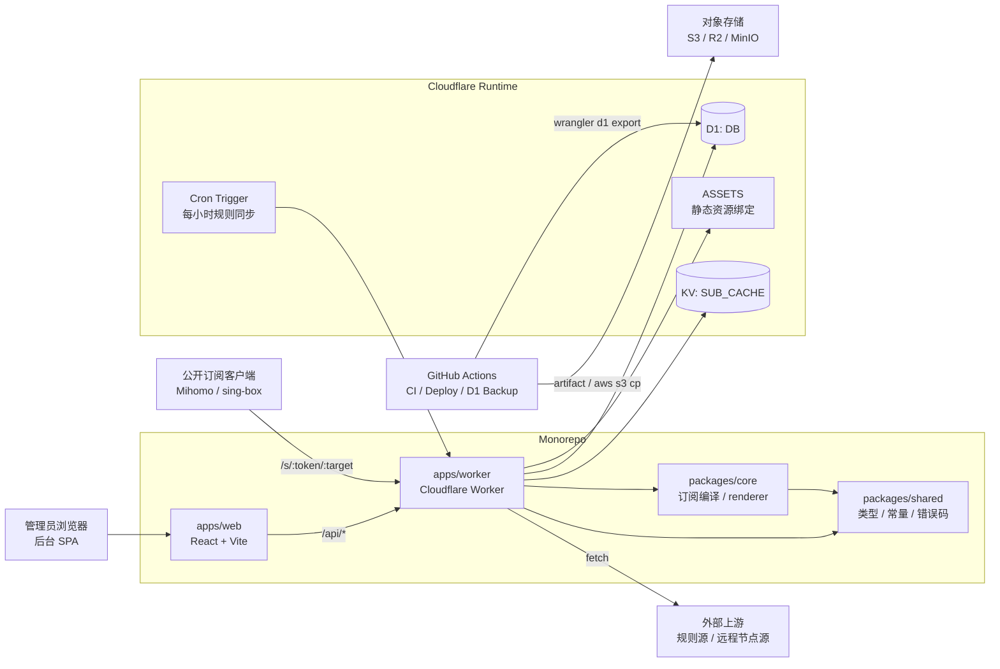
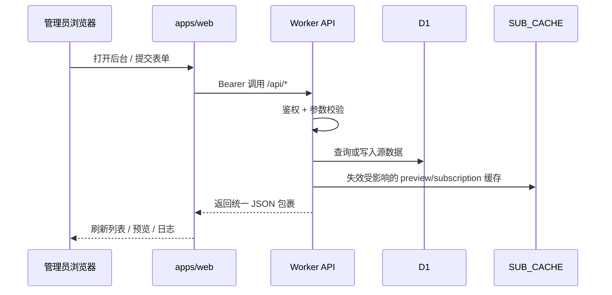
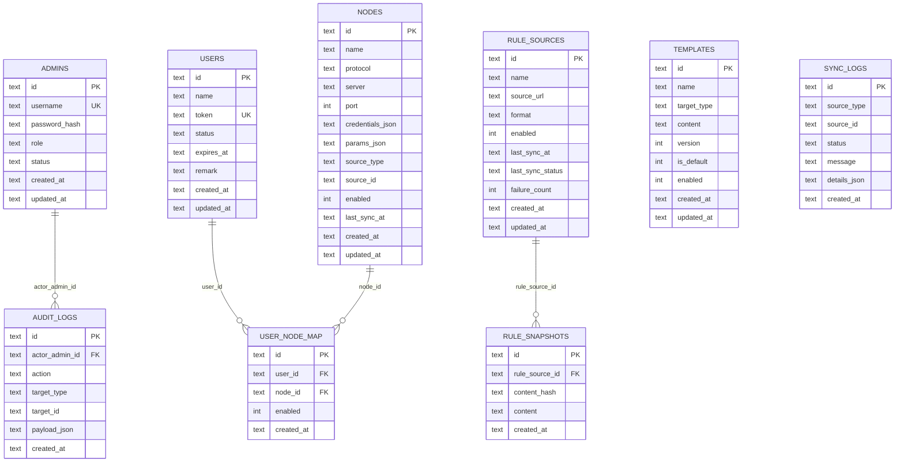

# SubForge 架构图与 ER 图

## 1. 文档目的

这份文档把当前仓库里已经落地的系统结构收敛成两类 Mermaid 图：

- 运行时架构图：帮助快速理解 `apps/web`、`apps/worker`、`packages/core`、`packages/shared`、Cloudflare 绑定资源与外部依赖如何协同
- ER 图：帮助快速理解 D1 中的核心实体、主外键关系、哪些表是“源数据”、哪些表是“观测与追踪数据”

与其他文档的分工：

- `docs/实施方案.md`：解释为什么这样分层、模块边界如何演进
- `docs/数据模型与表结构说明.md`：解释每张表的字段、索引与代码映射
- `docs/API接口矩阵与OpenAPI草案.md` 与 `openapi.yaml`：解释接口契约，而不是数据库关系
- `docs/部署指南.md`：解释 Cloudflare / GitHub Actions / D1 备份恢复操作步骤

## 2. 阅读约定

阅读这份文档时，可以先记住 4 个原则：

1. Worker 是唯一对外运行时入口：既处理 `/api/*` 与 `/s/:token/:target`，也兜底静态资源 `ASSETS`
2. D1 存“源数据”，KV `SUB_CACHE` 存“派生缓存”，缓存随数据变化被清理，不作为事实来源
3. `packages/core` 负责订阅编译，`packages/shared` 负责共享类型、常量、错误码与 cache key 约定
4. Cron、手动同步、GitHub Actions 备份都属于运维/调度平面，会围绕同一个 Worker / D1 数据面工作

## 3. 运行时架构图

### 3.1 总体架构



### 3.2 分层说明

- `apps/web`
  - 管理后台单页应用
  - 通过 `apps/web/src/api.ts` 调用 Worker API
  - 不直接访问 D1 / KV
- `apps/worker`
  - 对外暴露 `/health`、`/api/*`、`/s/:token/:target`
  - 负责鉴权、参数校验、D1 读写、缓存失效、Cron 同步、审计与同步日志
  - 通过 `env.ASSETS.fetch(request)` 兜底前端静态资源
- `packages/core`
  - 负责把用户、节点、模板、规则快照拼成订阅编译输入
  - 根据 `target = mihomo | singbox` 选择 renderer 输出最终内容
- `packages/shared`
  - 负责共享枚举、领域类型、错误码、cache key、目标类型常量
  - 是 `web` / `worker` / `core` 三方共享的稳定边界
- `D1`
  - 存管理员、用户、节点、模板、规则源、规则快照、绑定关系、同步日志、审计日志
- `SUB_CACHE`
  - 存预览缓存与公开订阅缓存
  - key 由共享层统一生成，值可丢失、可重建

## 4. 关键数据流

### 4.1 管理后台请求流



### 4.2 公开订阅输出流


### 4.3 同步与运维流

```mermaid
flowchart TD
  Cron[Cron Trigger] --> Sync[Worker scheduled()]
  Manual[管理员手动同步] --> Sync
  Sync --> Fetch[拉取规则源 / 远程节点源]
  Fetch --> Normalize[解析 / 归一化 / 去重]
  Normalize --> D1Write[写入 rule_sources / rule_snapshots / nodes]
  D1Write --> Logs[写入 sync_logs / audit_logs]
  D1Write --> CacheInvalidate[清理受影响缓存]

  Backup[GitHub Actions D1 Backup] --> Export[wrangler d1 export]
  Export --> Archive[artifact / .enc / .sha256]
  Archive --> Storage[GitHub Artifact / 对象存储]
```

说明：

- Cron 当前主要负责启用中的规则源同步；远程节点源同步仍以手动触发为主
- 远程规则源 / 远程节点源都属于“外部输入”，写库前会做解析和校验
- 备份链路不参与在线请求，但属于同一套数据平面的保护能力

## 5. ER 图



## 6. 关系解释

### 6.1 强关系

- `admins -> audit_logs`
  - 一个管理员可以产生多条审计日志
- `users <-> nodes`
  - 通过 `user_node_map` 建立多对多关系
  - 订阅编译时会按用户绑定拉取可用节点
- `rule_sources -> rule_snapshots`
  - 一个规则源会产生多份快照
  - 编译订阅时只读取每个规则源的最新快照

### 6.2 逻辑关系但未显式建外键

- `templates` 当前没有直接连到 `users`
  - 模板是按 `target_type` 选默认模板，而不是按用户单独绑定
- `sync_logs` 当前没有强外键指向 `rule_sources`
  - 用 `source_type + source_id` 记录来源，方便未来扩展到更多同步对象
- `nodes.source_type + source_id`
  - 这对字段把“手动节点”和“远程节点”统一进一张表
  - 远程节点同步时会按来源 URL 规划更新 / 禁用逻辑

### 6.3 派生层不进入 ER 图

以下对象是“运行时派生物”，不是 D1 事实表，因此没有进入 ER 图：

- `SUB_CACHE` 中的 preview / subscription 缓存
- 管理员 Bearer token
- 订阅编译中间模型
- GitHub Actions 备份 artifact / `.enc` / `.sha256`

## 7. 模块到数据面的映射

可以按下面方式快速记忆当前分工：

- `apps/web`
  - 消费 `openapi.yaml` / `/api/*` 契约
  - 不直接接触 D1 表
- `apps/worker/src/repository.ts`
  - 最接近 D1 表结构
  - 负责把 SQLite 行映射成 `packages/shared` 中的 Record 类型
- `apps/worker/src/index.ts`
  - 负责路由编排、鉴权、日志、缓存失效、同步触发
- `apps/worker/src/cache.ts`
  - 负责 `SUB_CACHE` 清理与重建
- `apps/worker/src/sync.ts`
  - 负责规则源同步、快照去重、同步结果结构化输出
- `packages/core/src/compile.ts`
  - 负责把“用户 + 节点 + 模板 + 规则快照”编译成目标订阅

## 8. 当前最值得关注的边界

如果后续继续演进，建议优先守住这些边界：

1. **Worker 仍保持唯一入口**：避免把鉴权、订阅输出、同步逻辑分散到多个运行时
2. **D1 只存事实数据**：缓存、备份、临时同步产物不要反向变成事实来源
3. **`packages/shared` 先于接口扩展**：新增枚举、错误码、领域类型时，优先稳定共享层
4. **订阅编译与 HTTP 解耦**：让 `packages/core` 继续只关心输入输出，而不是请求上下文
5. **观测表与业务表分层**：`sync_logs` / `audit_logs` 只做追踪，不承担业务事实职责

## 9. 相关文档

- `docs/实施方案.md`
- `docs/数据模型与表结构说明.md`
- `docs/API接口矩阵与OpenAPI草案.md`
- `openapi.yaml`
- `docs/部署指南.md`
